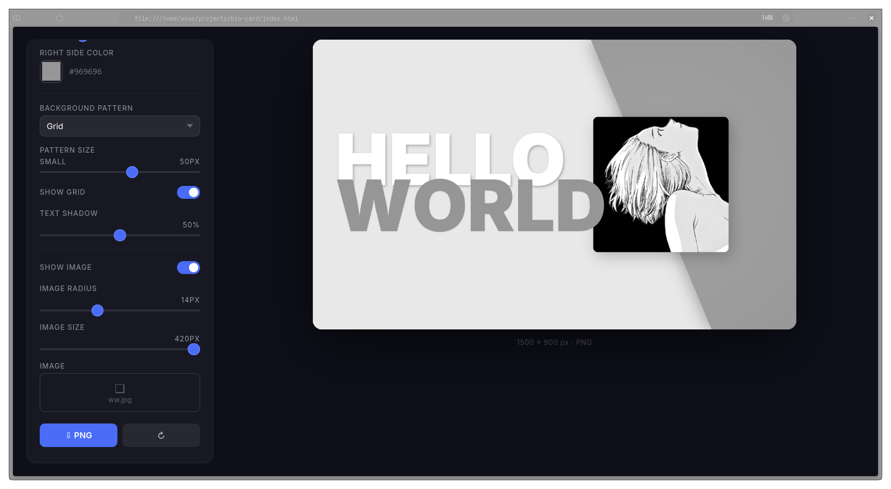

# Bio Card Generator

A minimal card generator with a diagonal split background.  
Pixels, text, grid — all customizable.

**What you can tweak:**
- Two lines of text
- Font, size, shadow
- Split ratio and diagonal angle
- Right side color
- Background pattern (grid, dots, lines, crosshatch, solid) + its size
- Image (your photo or a placeholder) + radius + size
- Toggle everything on/off

Export to 1500×900 PNG with one click.

Built with canvas, zero dependencies.
